## 2. Création et initialisation de votre premier dépôt

### a- Lancez git status
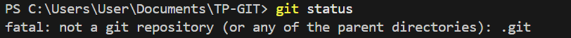

### b- Initialisez le dépôt avec git init
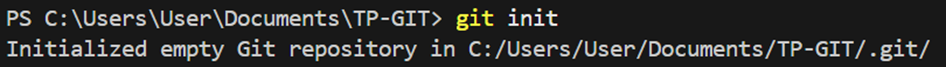

### c- Utilisez git status
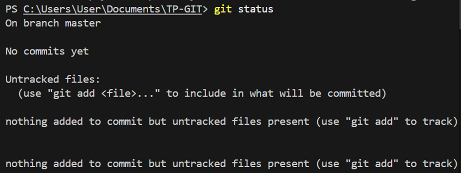

## 3. Suivre un fichier

###     d-Utilisez la commande git add <file_name> pour suivre le fichier par git. Puis exécutezà nouveau la commande git status:
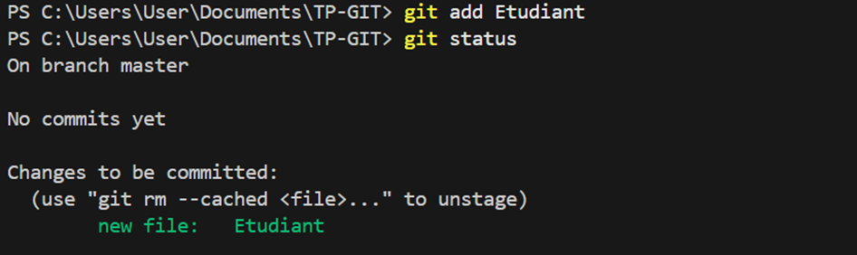
###    e-Créez un nouveau fichier et écrivez quelque chose à l’intérieur et Exécutez à nouveau la commande git status.
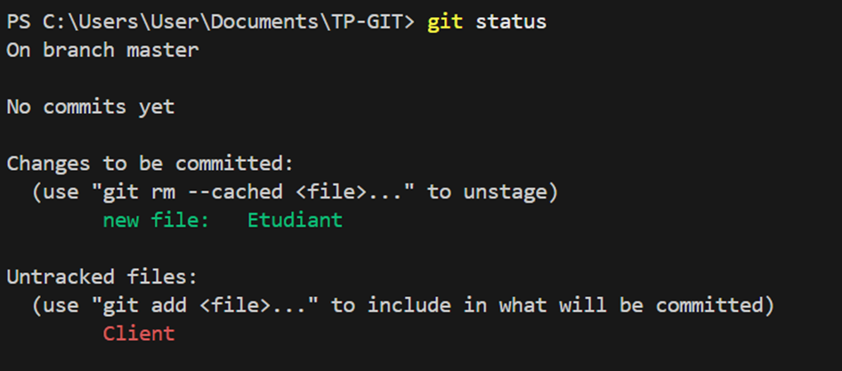

## 4. Passer votre premier commit
###     f-configurer git profil:
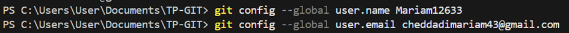
###   j-Exécutez la commande git commit -m "<message_de_commit>".
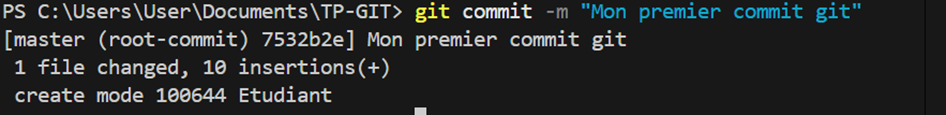
### h-Exécutez la commande git status. Que remarquez-vous ?
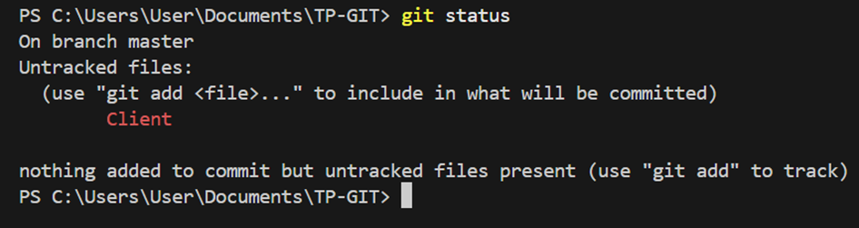
### i-Lancez la commande git log.
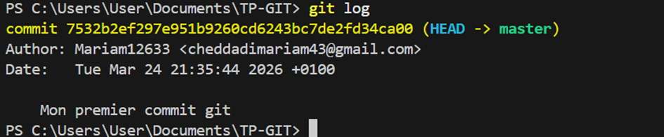
### g-Exécutez la commande git add -A , Qu’affiche la commande git status ?
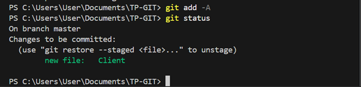
### k-Exécutez à nouveau la commande git commit avec un message de votre choix.
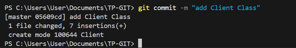
### l-Exécutez la commande git log.
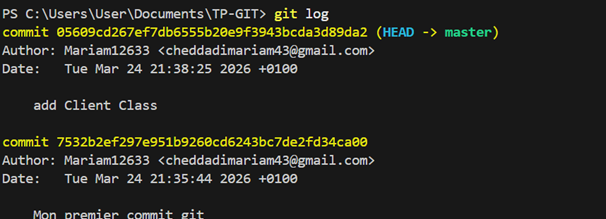
###  m-Ajouter un fichier text credential qui contient un fake login et mot de passe.
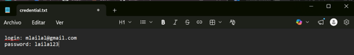
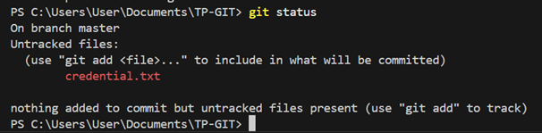
### n-Affichez la liste des fichiers dans votre répertoire.
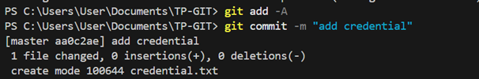
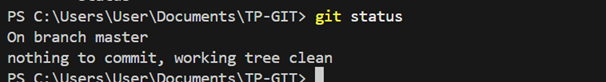
### O- Supprimez le suivi du fichier credentials avec la commande git rm credentials,et Exécutez la commande git status. 
 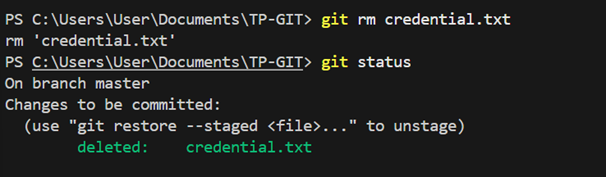
## 5. Ignorer un fichier.

### P-Ajoutez un fichier .gitignore et à la première ligne ajoutez credentials.
 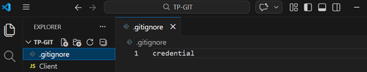

### Q-Ajoutez ce fichier au suivi.
 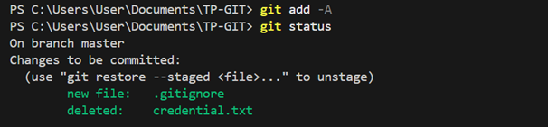
### R-Exécutez la commande git commit avec le message « ignore credentials ».
 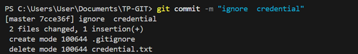
### S-Exécutez la commande git status,et Ajouter de nouveau le fichier text credentials qui contient un fake login et mot de passe.
 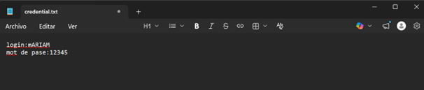
 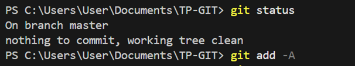
### T-Exécutez la commande git status. Que remarquez-vous ?
 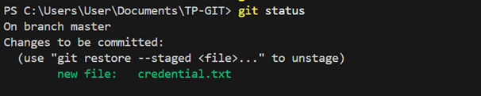